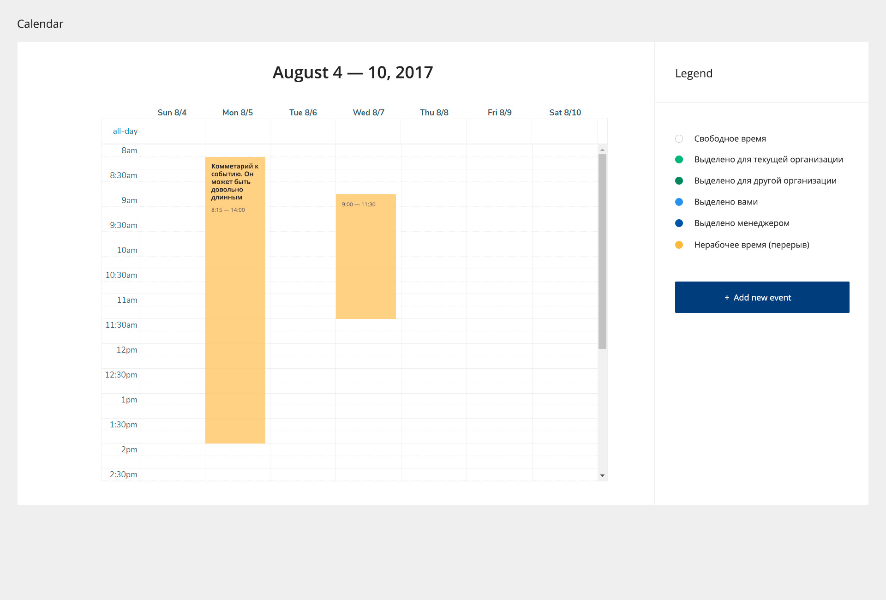
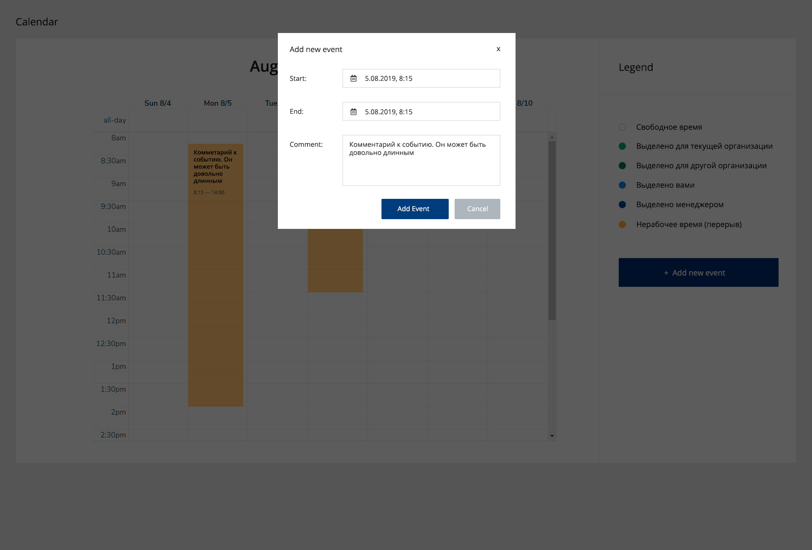

# Frontend
## Компонент календаря с отмеченными событиями
Необходимо написать приложение, которое рендерит календарь и события на нем на основе ответа от сервера.

Стек: React, Redux, Saga, Reselect. Инит проекта можно сделать через [CRA](https://github.com/facebook/create-react-app). В проекте необходимо использовать синтаксис ES6+. Препроцессоры CSS - по желанию.

## Базовый вариант задания
Приложение получает по АПИ данные в виде массива объектов, в которых содержится информация об отмеченных интервалах.

Пример ответа:
``` javascript
[
  {
    "id": 1,
    "start": "2019-08-05T08:15:00+04:00",
    "end": "2019-08-05T14:00:00+04:00",
    "type": 0,
    "comment": "Комметарий к событию. Он может быть довольно длинным"
  },
  {
    "id": 2,
    "start": "2019-08-05T09:00:00+04:00",
    "end": "2019-08-05T11:30:00+04:00",
    "type": 1,
    "comment": null
  },
]
```

Компонент выглядит согласно нижеприложенному макету (небольшие отклонения допускаются)


## Расширенный вариант задания 1
Сделать приложение адаптивным, чтобы все корректно отображалось и на десктопе и на мобильных устройствах.

## Расширенный вариант задания 2
Добавить переключение недели/месяца (дизайн на свое усмотрение). Реализовать функционал добавления Event. По кнопке открывается модельное окно, в котором пользователь добавляет новое событие. При добавлении необходимо событие показать на календаре и сделать POST запрост по любому урлу (неважно, что будет ошибка).

Пример запроса к серверу:

```
{
    "start": "2019-08-05T08:15:00+04:00",
    "end": "2019-08-05T14:00:00+04:00",
    "comment": "Комметарий к событию. Он может быть довольно длинным"
  }
```

Компонент выбора даты/времени использвать на свое усмотрение.

Пример модального окна с заполненными полями:


## Плюсом будет:
*  Детальное Readme.md
*  Использование eslint и airbnb
*  Покрытие кода тестами (jest + enzyme)